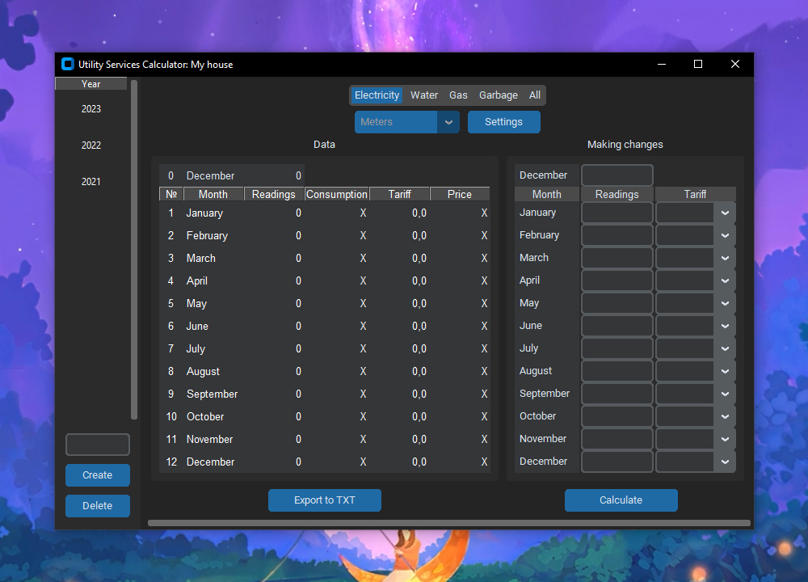
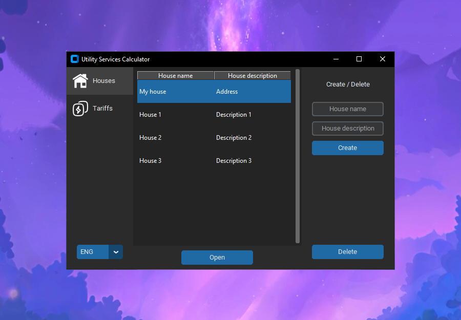
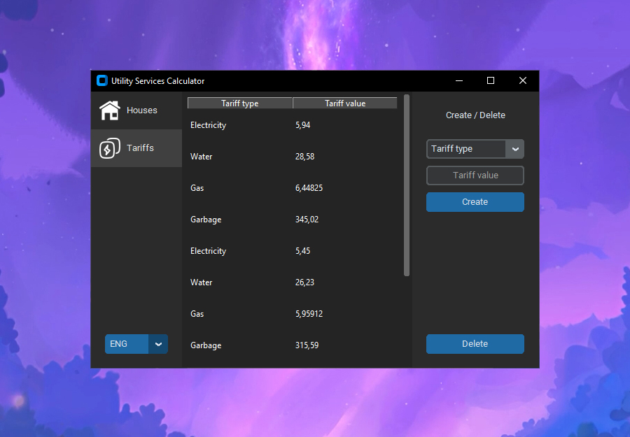
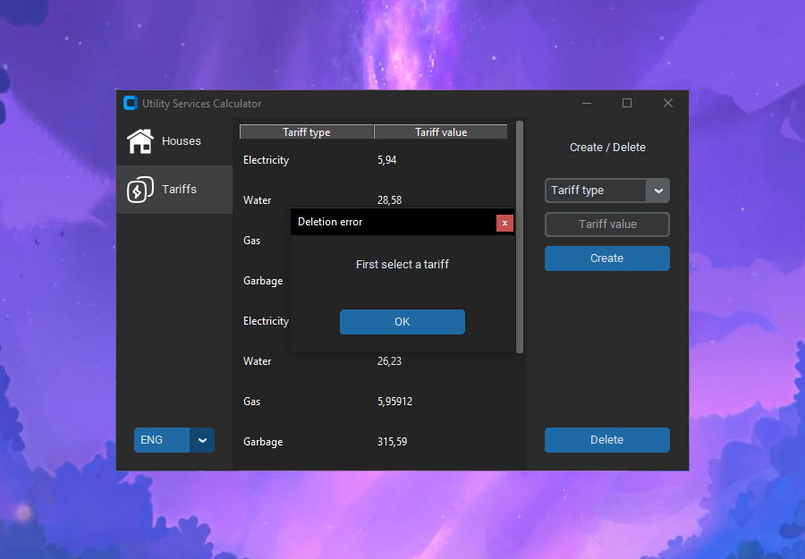
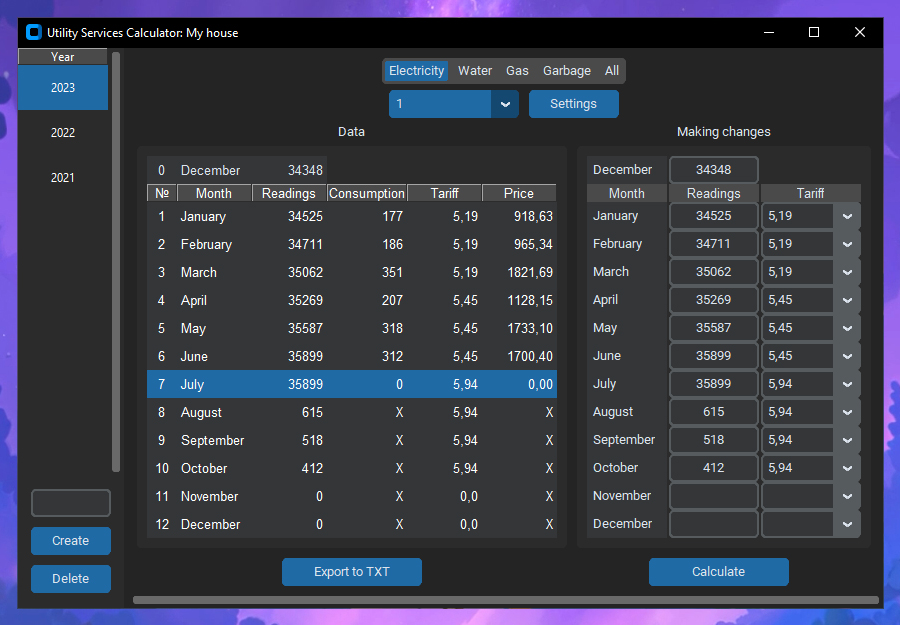
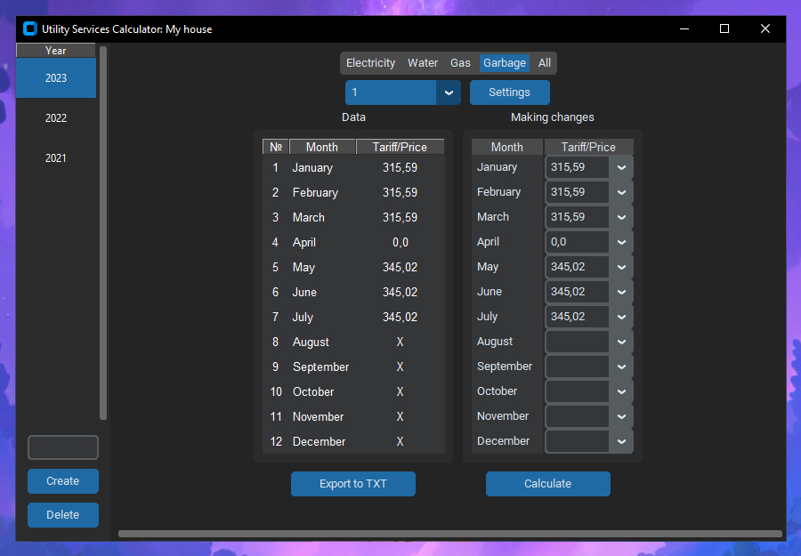

# Utility Services Calculator
> **Enter meter readings and tariffs to accurately calculate the cost of utilities**

## Features
- All calculation results are saved
- 4 tariff categories are available: Electricity, Water, Gas, Garbage (garbage tariff - immediately price)
- You can create many houses, in each of which you can create specific years for calculations
- For each such year, you can add additional meters in each category (not implemented, the limit is set to one meter for each category)
- Tariffs do not need to be introduced all the time. They are introduced once and then available in all houses
- Sorting tables (Houses, Tariffs, Years) by columns
- Support two languages: Russian, English

## Screenshots

### Main Window: Houses

### Main Window: Tariffs

### MessageBox Example

### House Window: Electricity

### House Window: Garbage

## Installation
python>=3.7.6 (lower versions not tested)